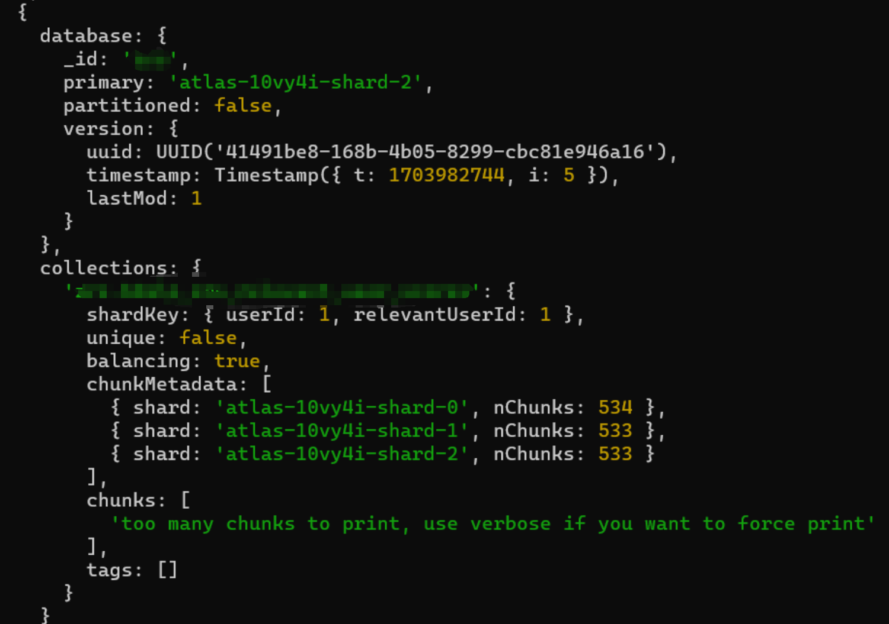
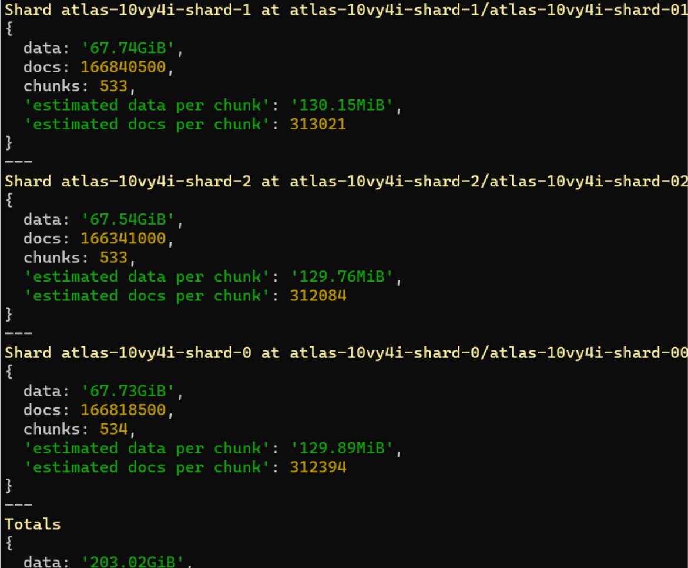

# MongoChunkSplitter

[中文](./README_CN.md) / EN

MongoChunkSplitter is a MongoDB sharding tool designed to facilitate pre-sharding and pre-chunking operations for MongoDB users. This tool offers a set of Python functions to calculate shard key split points and to automate sharding and chunk moving operations in a MongoDB cluster.






## Features
- Supports multiple character sets for defining split points.
- Enables automatic sharding to any number of shards without requiring any data in the collection.
- Automatically calculates split points based on data size and chunk size.
- Supports execution of sharding operations through command line or function calls.
- Provides a retry mechanism for enhanced reliability.

## Installation
Installation packages are not currently available. Clone the GitHub repository to use:
```bash
git clone https://github.com/finishy1995/MongoChunkSplitter.git
cd MongoChunkSplitter
```

## Usage Instructions
### As a Python Library
1. Import the MongoChunkSplitter module.
2. Create a MongoClient instance and connect to MongoDB.
3. Use the `split_hex_range` function to calculate the split points.
4. Use the `perform_splitting` function to execute sharding operations.

```python
from pymongo import MongoClient
from MongoChunkSplitter import split_hex_range, perform_splitting

# MongoDB connection setup
mongo_uri = "your_mongodb_uri"
client = MongoClient(mongo_uri)

# Database and collection names
database_name = "your_database_name"
collection_name = "your_collection_name"

# Shard key field
shard_key_field = "userId"  # or "userId,relevantUserId" for compound keys

# Calculate split points
data_size_mb = 1000  # Example data size in MB
chunk_size_mb = 64   # Example chunk size in MB
char_set = '0123456789abcdef'  # Example character set for hexadecimal
split_points = split_hex_range(char_set, data_size_mb, chunk_size_mb)

# Perform splitting
perform_splitting(client, database_name, collection_name, shard_key_field, split_points)

# Close the client connection
client.close()
```

### Through Command Line
(Planned, not yet implemented)

## Contributing
Contributions in the form of Pull Requests or Issues on GitHub are welcome.

## License
This project is licensed under the MIT License.