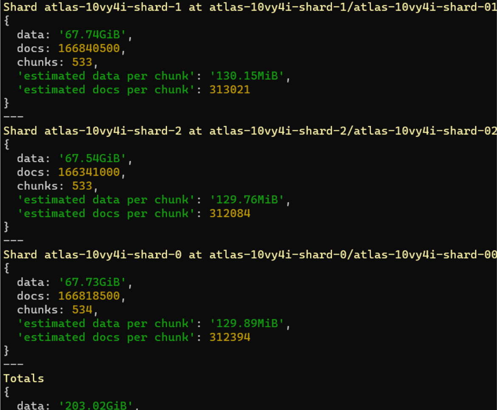

# MongoChunkSplitter

中文 / [EN](./README.md)

MongoChunkSplitter 是一个 MongoDB 分片工具，旨在帮助 MongoDB 用户更容易地进行预分片（pre-sharding）和预分块（pre-chunking）操作。该工具提供了一组 Python 函数，用于计算分片键的分片点，以及对 MongoDB 集群进行自动分片和块移动操作。




## 特性
- 支持多种字符集来定义分片点。
- 无需 collection 中有任何数据，自动分片到任意数量。
- 自动计算分片点，基于数据大小和块大小。
- 支持通过命令行或函数调用执行分片操作。
- 提供重试机制以增强操作的可靠性。

## 安装
暂未提供安装包，可以通过克隆 GitHub 仓库来使用：
```bash
git clone https://github.com/finishy1995/MongoChunkSplitter.git
cd MongoChunkSplitter
```

## 使用说明
### 作为 Python 库
1. 导入 MongoChunkSplitter 模块。
2. 创建 MongoClient 实例并连接到 MongoDB。
3. 使用 `split_hex_range` 函数计算分片点。
4. 使用 `perform_splitting` 函数执行分片操作。

```python
from pymongo import MongoClient
from MongoChunkSplitter import split_hex_range, perform_splitting

# MongoDB connection setup
mongo_uri = "your_mongodb_uri"
client = MongoClient(mongo_uri)

# Database and collection names
database_name = "your_database_name"
collection_name = "your_collection_name"

# Shard key field
shard_key_field = "userId"  # or "userId,relevantUserId" for compound keys

# Calculate split points
data_size_mb = 1000  # Example data size in MB
chunk_size_mb = 64   # Example chunk size in MB
char_set = '0123456789abcdef'  # Example character set for hexadecimal
split_points = split_hex_range(char_set, data_size_mb, chunk_size_mb)

# Perform splitting
perform_splitting(client, database_name, collection_name, shard_key_field, split_points)

# Close the client connection
client.close()
```

### 通过命令行
（计划中，暂未实现）

## 贡献
欢迎通过 GitHub 上的 Pull Requests 或 Issues 来贡献代码或提出建议。

## 许可证
此项目使用 MIT 许可证。